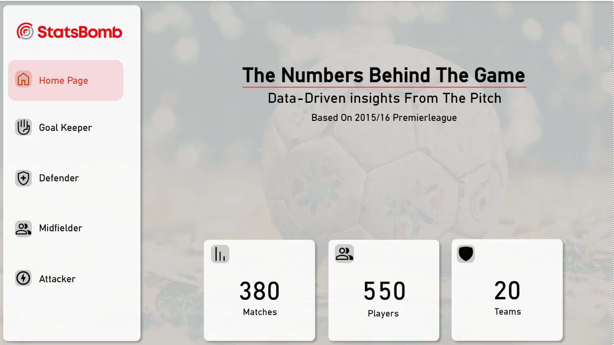
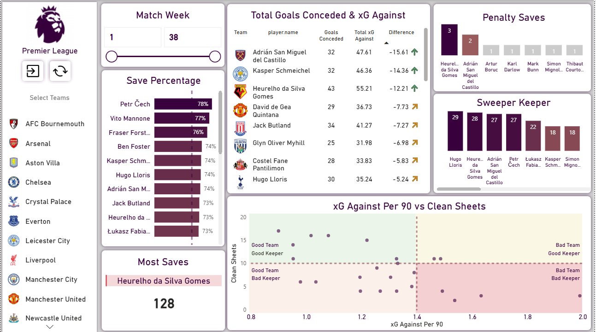
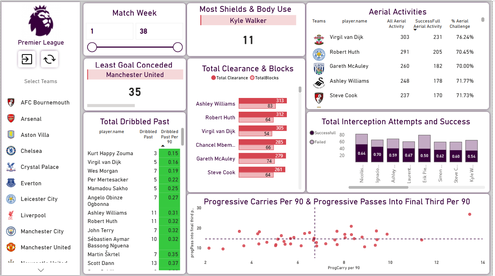
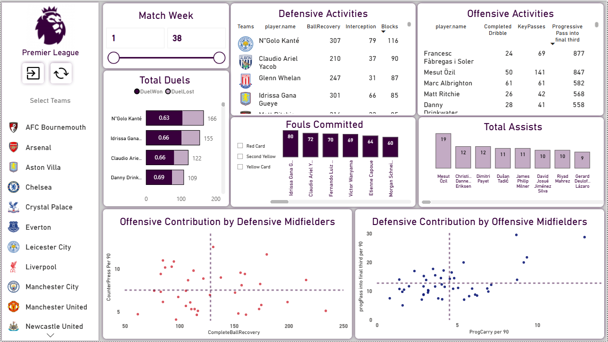
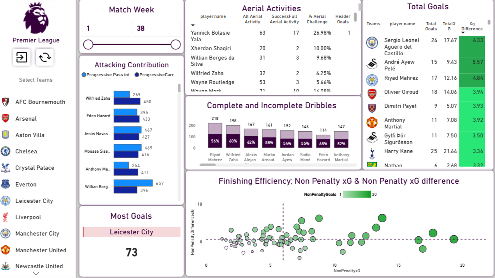

!# EPL 2015/16 Player Performance Analysis

## Dashboard Preview

### Home Page
 

### Goal Keeper Analysis

### Defender Analysis

### Medfielders Analysis

### Attackers Analysis

# EPL 2015/16 Player Performance Analysis

## Overview
This project analyzes player performance in the 2015/16 English Premier League season using StatsBomb event data. The analysis was developed in Power BI and focuses on player performance metrics, passing patterns, and statistical insights.

## Tools Used
- Power BI
- StatsBomb Open Data

## Download
Power BI file:
[Download PBIX Here]https://iutbox.iut.ac.ir/index.php/s/99N25c5cnQ75fG8

## Data Source
StatsBomb Open Data
